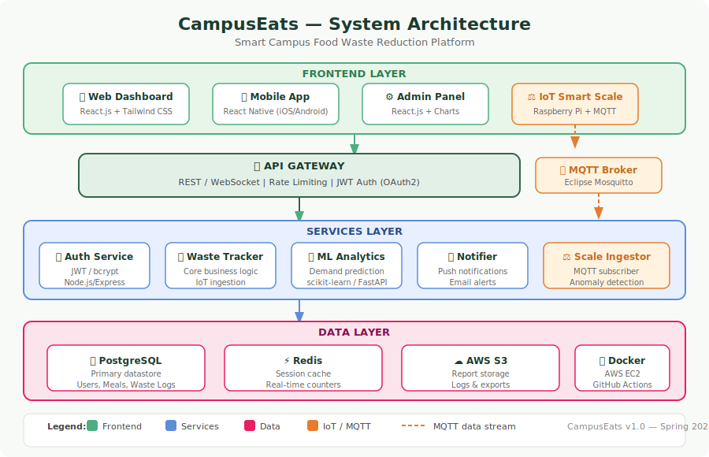

# 🌿 CampusEats — Smart Campus Food Waste Reduction Platform

> Reducing university cafeteria food waste by **30–40%** through real-time IoT tracking, predictive analytics, and actionable dashboards.

## 🚨 Problem Statement

University cafeterias generate significant food waste every day — with little visibility into **which dishes are over-produced**, **when peak demand occurs**, or **how much is wasted per meal**. This leads to:

- 💸 Unnecessary financial losses (~$2.5 per kg of wasted food)
- 🌍 Environmental harm (landfill and carbon emissions)
- 😔 Missed opportunities to redirect surplus food to students in need

**CampusEats** solves this by providing real-time food waste tracking and ML-powered demand forecasting for campus dining operations — helping managers make data-driven decisions and reduce waste by an estimated **30–40%**.

---

## 🏗️ System Architecture



| Layer | Technology |
|-------|-----------|
| Frontend (Web) | React.js, Tailwind CSS |
| Frontend (Mobile) | React Native (iOS & Android) |
| Backend / API | Python 3.11, FastAPI, asyncpg |
| Database | PostgreSQL, Redis |
| IoT Integration | MQTT (aiomqtt), Raspberry Pi smart scales |
| ML / Analytics | Python, scikit-learn, FastAPI |
| Cloud / DevOps | AWS (EC2, S3), Docker, GitHub Actions |

---

## ✨ Features

- **📊 Real-time Dashboard** — live waste metrics, cost estimates, and trend charts
- **⚖️ IoT Scale Integration** — Raspberry Pi smart scales push data via MQTT protocol
- **🤖 ML Demand Forecast** — Random Forest model predicts meal demand for the next 7 days
- **🔔 Smart Alerts** — anomaly detection triggers automatic alerts for waste spikes
- **📈 Analytics** — weekly trends, peak hours heatmap, top-wasted meals breakdown
- **🔐 Role-Based Access** — Admin / Manager / Staff roles with JWT authentication
- **📖 Auto API Docs** — interactive Swagger UI generated automatically by FastAPI

---

## 🚀 Quick Start

### Prerequisites
- Python 3.11+ (backend + ML)
- Node.js 20+ (frontend only)
- Docker & Docker Compose

### Run with Docker (recommended)

```bash
git clone https://github.com/yakubka/food_waste_reduction.git
cd food_waste_reduction
cp .env.example .env   # edit values
docker compose up --build
```

| Service | URL |
|---------|-----|
| Web Dashboard | http://localhost:3000 |
| API | http://localhost:3001 |
| API Docs (Swagger) | http://localhost:3001/api/docs |
| ML Service | http://localhost:8000/docs |

### Local Backend Development

```bash
cd backend
pip install -r requirements.txt
cp ../.env.example .env
uvicorn main:app --reload --port 3001
```

Interactive Swagger UI → **http://localhost:3001/api/docs**
ReDoc → **http://localhost:3001/api/redoc**

### Local Frontend Development

```bash
cd frontend
npm install
npm start
```

### Train the ML Model

```bash
cd ml
pip install -r requirements.txt
python train.py                          # train on historical DB data
uvicorn predict_api:app --port 8000      # serve predictions
```

---

## 📁 Project Structure

```
food_waste_reduction/
├── backend/
│   ├── main.py              # FastAPI app, lifespan, CORS, error handling
│   ├── requirements.txt
│   ├── Dockerfile
│   ├── core/
│   │   ├── config.py        # Settings via pydantic-settings
│   │   ├── database.py      # asyncpg connection pool
│   │   ├── security.py      # JWT + bcrypt helpers
│   │   └── schema.sql       # PostgreSQL schema
│   ├── models/
│   │   └── schemas.py       # Pydantic v2 request/response models
│   ├── routers/
│   │   ├── auth.py          # POST /api/auth/login|register
│   │   ├── waste.py         # GET/POST /api/waste
│   │   ├── meals.py         # GET/POST /api/meals
│   │   ├── analytics.py     # GET /api/analytics/*
│   │   └── alerts.py        # GET/PATCH /api/alerts
│   └── services/
│       └── mqtt_service.py  # Async MQTT listener (aiomqtt)
├── frontend/
│   └── src/
│       ├── pages/           # Dashboard, WasteLogs, Analytics, Meals, Alerts, Login
│       ├── components/      # Layout, shared UI
│       └── services/        # Axios API client, Zustand auth store
├── ml/
│   ├── train.py             # Random Forest training script
│   ├── predict_api.py       # FastAPI prediction endpoint
│   └── requirements.txt
├── docs/
│   ├── system_diagram.svg   # Architecture diagram
│   └── api.md               # Full API reference
├── .github/workflows/ci.yml # CI/CD — pytest + React tests + Docker build
└── docker-compose.yml
```

---

## 🔌 API Reference

Full documentation: [docs/api.md](docs/api.md) | Interactive: `/api/docs`

| Method | Endpoint | Auth | Description |
|--------|----------|------|-------------|
| POST | `/api/auth/register` | — | Register new user |
| POST | `/api/auth/login` | — | Login, get JWT token |
| GET | `/api/waste` | ✅ | List waste logs |
| POST | `/api/waste` | ✅ | Log a waste entry |
| GET | `/api/waste/summary/daily` | ✅ | Daily waste summary (30d) |
| GET | `/api/meals` | ✅ | List meals |
| POST | `/api/meals` | admin/manager | Create meal |
| GET | `/api/meals/{id}/waste-trend` | ✅ | Waste trend for a meal |
| GET | `/api/analytics/overview` | ✅ | 30-day stats overview |
| GET | `/api/analytics/demand-forecast` | ✅ | 7-day ML demand forecast |
| GET | `/api/analytics/reduction` | ✅ | Weekly reduction trend |
| GET | `/api/alerts` | ✅ | List alerts |
| PATCH | `/api/alerts/{id}/read` | ✅ | Mark alert as read |
| GET | `/health` | — | Health check |

---

## 🧪 Testing

```bash
# Backend (pytest)
cd backend && pytest tests/ -v

# Frontend
cd frontend && npm test

# ML
cd ml && pytest tests/ -v
```

---

## 🤝 Implementation Timeline

| Phase | Weeks | Description |
|-------|-------|-------------|
| Research & Requirements | 1–2 | Interviews, stack finalization |
| System Design | 3–4 | Architecture, DB schema, wireframes |
| Core Development | 5–8 | FastAPI backend, DB, IoT, React frontend |
| ML / Analytics | 9–10 | Demand prediction, anomaly detection |
| Testing & Deployment | 11–12 | pytest, UAT, pilot rollout, AWS deployment |

---

## 👥 Team

Built for **Introduction to Software Engineering — Spring 2026** using Claude AI (claude.ai).

---

## 📜 License

MIT
